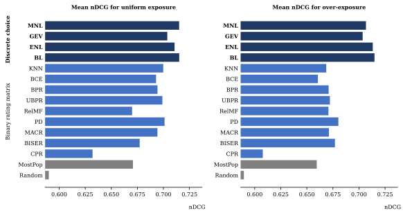
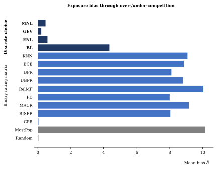

# Code Repository for "Mitigating Exposure Bias in Recommender Systems – A Comparative Analysis of Discrete Choice Models"

This is a code repository for the unpublished research paper "Mitigating Exposure Bias in Recommender Systems – A Comparative Analysis of Discrete Choice Models" by Thorsten Krause, Alina Deriyeva, Jan H. Beinke, Gerrit Y. Bartels, and Oliver Thomas. 

If you use any part of this code, please cite it using the following BibTex:

(BibTex)

## Repository Under Construction
Please note that this repository is currently under construction and may not be fully functional. We apologize for any inconvenience this may cause. We are working to complete the repository as soon as possible.

## Data set

## Baselines
We used the following baselines:
- Random: Returns random recommendations.
- MostPopular
- k-nearest-neighbors (KNN)
- Binary cross entropy matrix factorization (BCE)
- Bayesian Personalized Ranking (BPR)
- Unbiased Bayesian Personalized Ranking (UBPR)
- Relevance Matrix Factorization (RelMF)
- Popularity-bias Deconfounding (PD)
- Model-Agnostic Counterfactual Reasoning (MACR)
- BIlateral SElf-unbiased Recommender (BISER)
- Cross Pairwise Ranking (CPR)

We plan to include the code for PD as soon as the authors include the necessary licenses. We apologize for any delay this may cause. Thank you for your patience and understanding.

## Installation
Running the code requires an installation of python 3.9.x. To install the necessary components for this project, create and activate an environment, and run the following command:

```
pip install -r requirements.txt
```

## Running the Code

To run the entire experiment, run `main.py` in the `src` directory

```
python3 src/main.py
```

To run individual models, please follow the instructions below:

(Instructions on running the code for individual models)

## Hyperparameters

All hyperparameters used in this project are contained in the `src/config.py` file.

## Results

The expected results of this project include the following:
- Exposure bias benchmarks for all models in the first experiment
- nDCG scores for the first experiment
- Exposure bias benchmarks for all models in the second experiment
- nDCG scores for the second experiment

### Tables
All tables from the paper are stored at `data/output/tables.docx`.

### Plots
Our results are visualized in the following .svg images, which can be found in the `data/output/plots` directory:
- `bias_overexposure_side_by_side.svg`: Exposure bias benchmarks for all models in the first experiment 
- `performance_overexposure_side_by_side.svg`: Respective nDCG scores for the first experiment 
- `bias_competition.svg`: Exposure bias benchmarks for all models in the second experiment 
- `performance_competition_side_by_side.svg`: Respective nDCG scores for the second experiment 


